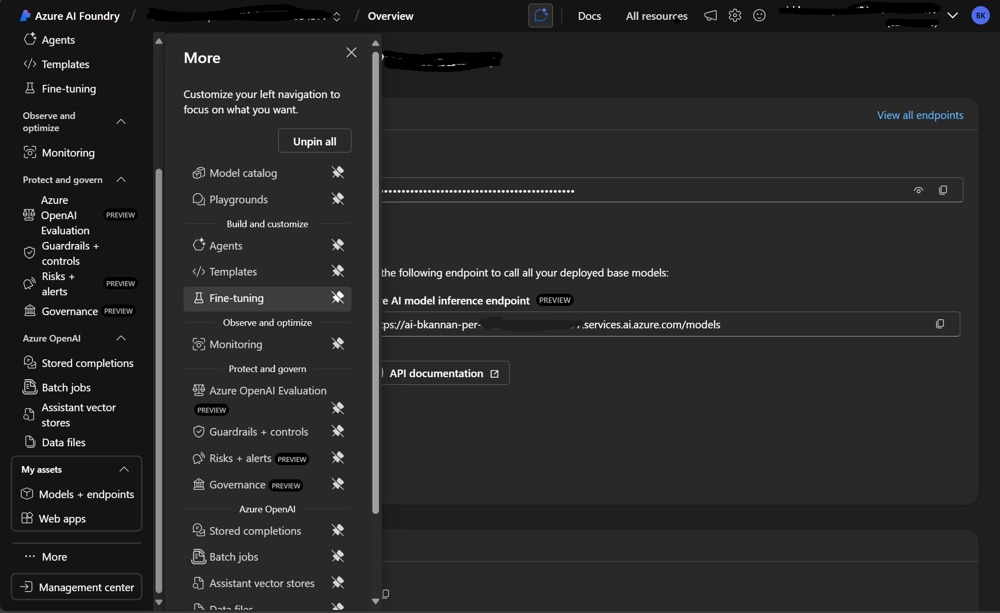
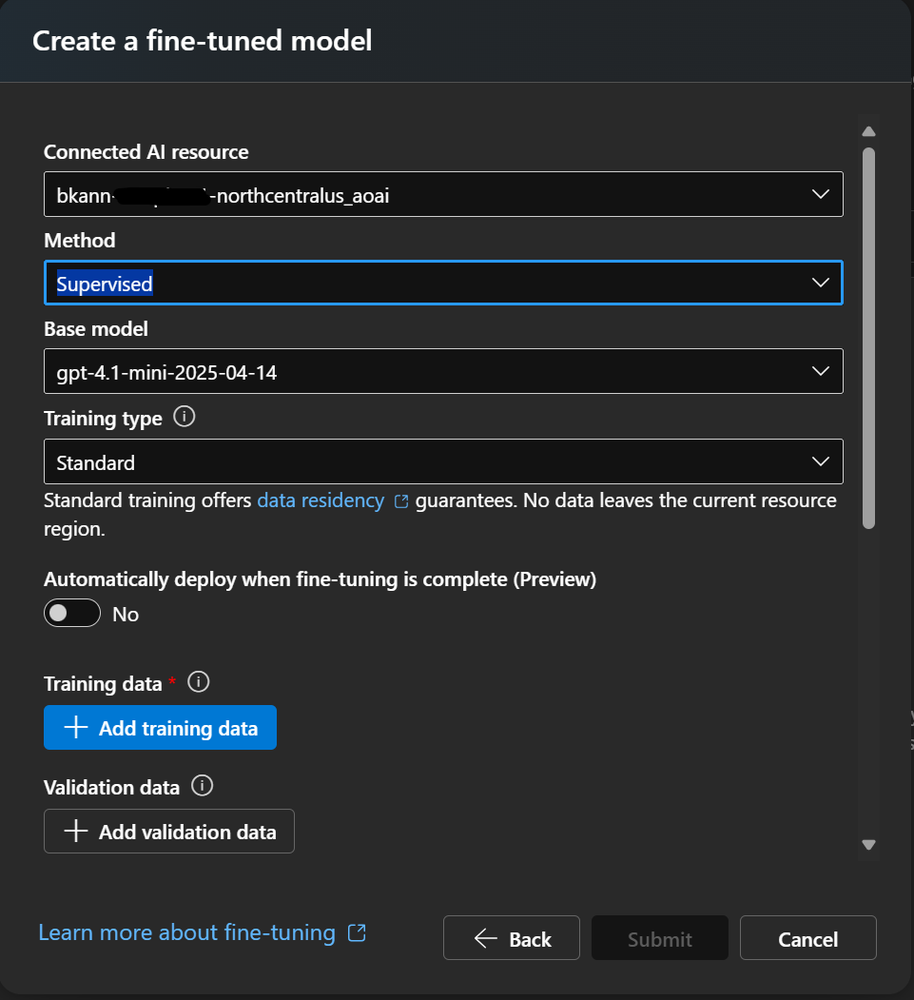
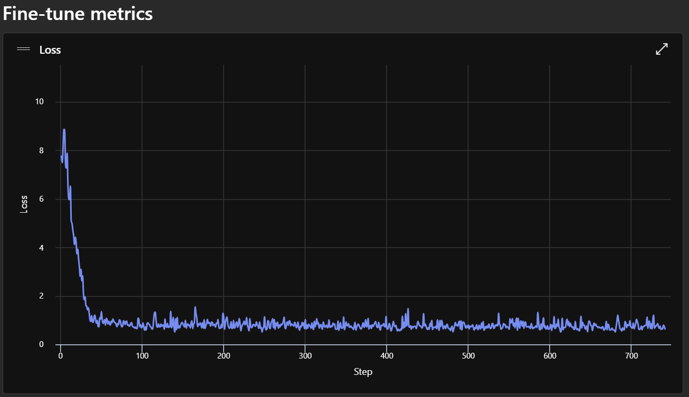

In the previous [post](2025-08-23-Fine-tune-LLM-to-predict-NIFTY50.md) we have prepared a dataset consisting of minute level Nifty50 index price for the last 10 years. We've done some data cleansing and split the dataset into training and validation set. Please skim through that if you haven't yet. In this blog we're going to use the training set to fine-tune a GPT model in Azure AI Foundry. Then we'll use the validation set to check whether the fine-tuned model can make a profit for us.

## Prepare Training Conversations
The prepared dataset is stored under the [dataset](https://github.com/0xba1a/0xba1a.github.com/blob/master/ai_market_prediction/dataset/) directory. We'll use the *train_price_movements.csv* for fine-tuning the model. Here is the glimpse of the content of the file.
``` py linenums="1"
import pandas as pd
training_set = pd.read_csv('dataset/train_price_movements.csv')
training_set.head()
```
**Output**
<div>
<style scoped>
    .dataframe tbody tr th:only-of-type {
        vertical-align: middle;
    }

    .dataframe tbody tr th {
        vertical-align: top;
    }

    .dataframe thead th {
        text-align: right;
    }
</style>
<table border="1" class="dataframe">
  <thead>
    <tr style="text-align: right;">
      <th></th>
      <th>date</th>
      <th>09:15</th>
      <th>09:16</th>
      <th>09:17</th>
      <th>09:18</th>
      <th>09:19</th>
      <th>09:20</th>
      <th>09:21</th>
      <th>09:22</th>
      <th>09:23</th>
      <th>...</th>
      <th>15:20</th>
      <th>15:21</th>
      <th>15:22</th>
      <th>15:23</th>
      <th>15:24</th>
      <th>15:25</th>
      <th>15:26</th>
      <th>15:27</th>
      <th>15:28</th>
      <th>15:29</th>
    </tr>
  </thead>
  <tbody>
    <tr>
      <th>0</th>
      <td>2015-01-09</td>
      <td>0.0</td>
      <td>0.09</td>
      <td>-0.06</td>
      <td>0.08</td>
      <td>0.08</td>
      <td>-0.00</td>
      <td>0.00</td>
      <td>0.02</td>
      <td>-0.09</td>
      <td>...</td>
      <td>-0.01</td>
      <td>0.02</td>
      <td>0.01</td>
      <td>0.01</td>
      <td>0.03</td>
      <td>-0.00</td>
      <td>-0.04</td>
      <td>-0.01</td>
      <td>0.01</td>
      <td>-0.03</td>
    </tr>
    <tr>
      <th>1</th>
      <td>2015-01-12</td>
      <td>0.0</td>
      <td>-0.45</td>
      <td>0.01</td>
      <td>0.04</td>
      <td>0.06</td>
      <td>0.05</td>
      <td>-0.02</td>
      <td>0.03</td>
      <td>0.06</td>
      <td>...</td>
      <td>0.04</td>
      <td>-0.04</td>
      <td>0.02</td>
      <td>0.00</td>
      <td>-0.01</td>
      <td>0.04</td>
      <td>0.01</td>
      <td>-0.01</td>
      <td>0.00</td>
      <td>-0.01</td>
    </tr>
    <tr>
      <th>2</th>
      <td>2015-01-13</td>
      <td>0.0</td>
      <td>0.11</td>
      <td>-0.08</td>
      <td>-0.05</td>
      <td>-0.02</td>
      <td>-0.03</td>
      <td>-0.01</td>
      <td>0.01</td>
      <td>-0.09</td>
      <td>...</td>
      <td>0.08</td>
      <td>0.01</td>
      <td>0.01</td>
      <td>0.01</td>
      <td>0.01</td>
      <td>0.00</td>
      <td>0.00</td>
      <td>-0.01</td>
      <td>-0.02</td>
      <td>0.03</td>
    </tr>
    <tr>
      <th>3</th>
      <td>2015-01-14</td>
      <td>0.0</td>
      <td>-0.08</td>
      <td>0.07</td>
      <td>0.02</td>
      <td>-0.04</td>
      <td>-0.01</td>
      <td>-0.03</td>
      <td>-0.11</td>
      <td>0.04</td>
      <td>...</td>
      <td>0.08</td>
      <td>-0.01</td>
      <td>0.02</td>
      <td>0.03</td>
      <td>0.01</td>
      <td>0.01</td>
      <td>0.00</td>
      <td>0.02</td>
      <td>0.02</td>
      <td>0.01</td>
    </tr>
    <tr>
      <th>4</th>
      <td>2015-01-15</td>
      <td>0.0</td>
      <td>0.18</td>
      <td>-0.55</td>
      <td>-0.10</td>
      <td>0.18</td>
      <td>0.32</td>
      <td>-0.23</td>
      <td>-0.12</td>
      <td>0.22</td>
      <td>...</td>
      <td>-0.04</td>
      <td>-0.07</td>
      <td>-0.11</td>
      <td>-0.06</td>
      <td>-0.11</td>
      <td>-0.05</td>
      <td>0.06</td>
      <td>-0.05</td>
      <td>0.03</td>
      <td>0.00</td>
    </tr>
  </tbody>
</table>
</div>

<br />

Our expectation is when feed the price movement till 2.30PM, the model should tell us what is the most probable price it will reach before the market close. Based on that price we'll either buy or sell (short) the index at 2.30.

OpenAI GPTs are conversational models. So, the training dataset should be converted into set of conversations. Each conversation should have a system message, a user message and an assistant message. In our case the system message will be a role assignment for the LLM. The user message will be the market movement and the assistant message will be the target price for that day.

## How to determine target price?
Before converting the current dataset into conversations, we need to establish a method for determining the target price for each day in the training dataset. This is essential because the training conversation requires the `target_price` to be included as the assistant's response. Therefore, we must devise a systematic approach to calculate the target price using the price movement data available after 2:30 PM.

We have price movement in percentage from 2.31PM to 3.29PM. As we're going to square off our position by 3.25PM itself, let's consider only upto 3.25PM. And each number in the dataset is relative percentage difference from the previous price. So, it is a geometric progression.

We should know price oscillations with respect to the price at 2.30 at every minute until 3.25. So, if we're buying at 2.30, we should sell at a time when the price reached the peak. Or if we're selling (shorting) we should buy back when the price is at the bottom of the graph. Here we are going to identify the most probable price (or movement) close to the maximum or minimum and use that as the target price.

Please note that we're not taking the best price here. Because the best price will be an outlier in the sequence. It may not properly represent the trend in the price setting. So, take the price ocillation range and take the first standard deviation. By this we have approximately 66% possibility to reach the target price. And this is our expectation from the LLM also. To make profit in long-term, we trade high profit in a day for more stable returns.

Let's create a sequence of price difference with respect to the base price at 2.30 and find it's mean and std. If the mean is positive, let's set the target price as `mean+std`. Otherwise the short target price is `mean-std`. Let's do this for first sequence in this dataset.
``` py linenums="1"
# Set the date column as index
training_set_indexed = training_set.set_index('date')

target_date = '2015-01-09'
target_time = '14:30'

# Get data for the target date
day_data = training_set_indexed.loc[target_date]

# Print the price movement at 2:30 PM
print(f"Price movement at {target_time} on {target_date}: {day_data.loc[target_time]}%")

# Calculate cumulative price changes from 2:30 PM onwards
# Starting with 1.0 at 2:30 PM (baseline)
price_diff_with_respect_to_230 = []
time_labels = []
cur = 1.0  # Starting value at 2:30 PM

# Generate times from 2:31 PM to 3:25 PM
for hour in [14, 15]:  # 2 PM and 3 PM in 24-hour format
    start_min = 31 if hour == 14 else 0  # Start from 31 min for 2 PM, 0 min for 3 PM
    end_min = 60 if hour == 14 else 26   # End at 60 min for 2 PM, 26 min for 3 PM

    for minute in range(start_min, end_min):
        time_str = f"{hour}:{minute:02d}"

        if time_str in day_data.index:
            # Apply the percentage change: new_value = current * (1 + percentage_change/100)
            percentage_change = day_data.loc[time_str]
            cur = cur * (1 + percentage_change / 100)
            price_diff_with_respect_to_230.append(cur)
            time_labels.append(time_str)

# Create DataFrame with results
result_df = pd.DataFrame({
    'time': time_labels,
    'cumulative_price_factor': price_diff_with_respect_to_230
})

print(f"\nCumulative price changes from 2:30 PM baseline:")
print(f"Mean: {result_df['cumulative_price_factor'].mean():.2f}")
print(f"Std: {result_df['cumulative_price_factor'].std():.2f}")
print(f"Min: {result_df['cumulative_price_factor'].min():.2f}")
print(f"Max: {result_df['cumulative_price_factor'].max():.2f}")

mean = result_df['cumulative_price_factor'].mean()
std = result_df['cumulative_price_factor'].std()

if mean >= 1:
    position = "Call"
    target_percentage = round((mean + std), 4)
else:
    position = "Put"
    target_percentage = round((mean - std), 4)

print(f"{position}. Target Percentage: {target_percentage}")
```
**Output**
```
Price movement at 14:30 on 2015-01-09: 0.01%

Cumulative price changes from 2:30 PM baseline:
Mean: 1.35
Std: 0.24
Min: 0.90
Max: 1.84
Call. Target Percentage: 1.0053
```

By multiplying the `target_percentage` with the base price i.e. the price at 2.30PM, we'll get the target price. We have the price sequence data in `dataset/train_daily_opens.csv`. Let's calculate the position and target price for `09-01-2015`.
``` py linenums="1"
training_prices = pd.read_csv('dataset/train_daily_opens.csv')
# training_prices.head()
training_prices.set_index('date', inplace=True)
day_price = training_prices.loc[target_date]
base_price = day_price.loc[target_time]
print(f"Base Price at {target_time} on {target_date}: {base_price}")
target_price = base_price * target_percentage
print(f"{position}. Target Price: {target_price}")
```
**OutPut**
```
Base Price at 14:30 on 2015-01-09: 8240.0
Call. Target Price: 8283.672
```
*This price calculation is only for illustration purposes. We're not going to pass it to the LLM. Because, we're not going to give it any price related context. We'll pass only the price movement in percentage and expect it to provide the multiplication factor. We'll multiply the factor with the base price and determine the target price programmatically.*

To prepare the training dataset for fine-tuning, we need to convert the entire dataset into a conversational format and save it as a JSONL file. For each day in the dataset, we will calculate the multiplication factor (`target_percentage`) following the above method. The model will be trained to predict only the `target_percentage` given the market movement sequence. The `target_price` will be derived later using the `base_price` at the time of evaluation.
``` py linenums="1"
training_conversations = []

# traverse every item in the training_set_indexed
for index, row in training_set_indexed.iterrows():
    date = index  # The date is the index, not row['date']

    # Convert date string to datetime to get day name
    date_obj = pd.to_datetime(date)
    day_of_the_date = date_obj.day_name()

    # Filter row to only include times from 9:15 AM to 2:30 PM
    # Create time range from 09:15 to 14:30
    times_until_230 = []
    for hour in range(9, 15):  # 9 AM to 2 PM
        start_min = 15 if hour == 9 else 0  # Start from 15 min for 9 AM, 0 min for others
        end_min = 60
        for minute in range(start_min, end_min):
            times_until_230.append(f"{hour:02d}:{minute:02d}")

    # Add 14:30 (2:30 PM)
    times_until_230.append("14:30")

    # Filter row data to only include times until 2:30 PM
    row_until_230 = row[row.index.isin(times_until_230)]

    # Get the current day's data for post-2:30 PM calculations
    day_data = row  # This is the full day's data

    percent_diff_with_respect_to_230 = []
    time_labels = []
    cur = 1.0  # Take the base as 1

    for hour in [14, 15]:
        start_min = 31 if hour == 14 else 0
        end_min = 60 if hour == 14 else 26  # Fixed: changed 'or' to 'else'

        for minute in range(start_min, end_min):  # Fixed: added colon
            time_str = f"{hour}:{minute:02d}"

            if time_str in day_data.index:
                percentage_change = day_data.loc[time_str]
                cur = cur * (1 + percentage_change / 100)
                percent_diff_with_respect_to_230.append(cur)
                time_labels.append(time_str)

    result_df = pd.DataFrame({
        'time': time_labels,
        'cumulative_price_factor': percent_diff_with_respect_to_230
    })

    mean = result_df['cumulative_price_factor'].mean()
    std = result_df['cumulative_price_factor'].std()

    if mean >= 1:
        position = "Call"
        target_percentage = round((mean + std), 4)
    else:
        position = "Put"
        target_percentage = round((mean - std), 4)

    base_price = training_prices.loc[date].loc['14:30']
    target_price = base_price * target_percentage

    # Use row_until_230 instead of full row for the conversation
    conversation = {
        "messages": [
            {
                "role": "system",
                "content": "You are a stock market expert. You will predict the most profit making position and what is the expected percentage change in the next 1 hour given the percentage movement between 9.15 AM and 2.30 PM."
            },
            {
                "role": "user",
                "content": "The price movements in percentage from 9:15 AM to 2:30 PM on " + str(date) + " (" + day_of_the_date + ") are as follows: " + str(row_until_230.values.tolist()) + "."
            },
            {
                "role": "assistant",
                "content": str(target_percentage)
            }
        ]
    }

    training_conversations.append(conversation)

print(f"Generated {len(training_conversations)} training conversations")
print(training_conversations[0])

# Store `training_conversations` in a jsonl file.
import json

with open("dataset/training_conversations_gpt.jsonl", "w", encoding="utf-8") as f:
    for conversation in training_conversations:
        f.write(json.dumps(conversation) + "\n")
```
**Output**
```
Generated 1975 training conversations
{'messages': [{'role': 'system', 'content': 'You are a stock market expert. You will predict the most profit making position and what is the expected percentage change in the next 1 hour given the percentage movement between 9.15 AM and 2.30 PM.'}, {'role': 'user', 'content': 'The price movements in percentage from 9:15 AM to 2:30 PM on 2015-01-09 (Friday) are as follows: [0.0, 0.09, -0.06, 0.08, 0.08, -0.0, 0.0, 0.02, -0.09, 0.0, 0.08, -0.08, -0.07, 0.03, -0.02, 0.04, -0.06, 0.0, -0.08, 0.01, 0.07, -0.05, 0.0, -0.07, 0.04, 0.01, 0.02, 0.01, -0.07, -0.03, 0.09, -0.05, 0.02, -0.04, -0.01, 0.06, -0.1, 0.04, 0.0, -0.0, -0.03, -0.01, 0.05, 0.04, -0.04, 0.03, 0.02, 0.01, 0.02, -0.02, 0.01, -0.02, 0.02, -0.03, 0.0, -0.04, -0.01, -0.04, 0.02, 0.02, 0.03, 0.01, -0.02, -0.0, 0.03, 0.01, 0.0, 0.03, 0.0, -0.01, 0.02, 0.01, -0.02, 0.02, 0.03, -0.0, -0.01, -0.04, 0.02, -0.01, 0.01, -0.02, -0.03, 0.02, -0.01, 0.02, -0.02, -0.02, 0.0, -0.01, -0.01, -0.02, 0.03, -0.02, 0.01, -0.0, -0.01, 0.02, 0.02, -0.01, 0.02, -0.02, 0.03, 0.01, 0.0, -0.01, 0.02, -0.01, -0.05, 0.03, 0.03, -0.02, -0.02, -0.02, -0.02, 0.01, 0.02, -0.01, -0.0, 0.04, -0.04, -0.0, -0.03, -0.02, -0.01, 0.02, -0.01, 0.02, 0.02, -0.13, -0.03, -0.03, 0.02, -0.0, -0.0, -0.02, -0.13, 0.06, -0.07, 0.0, 0.04, 0.05, -0.02, -0.05, -0.01, -0.01, 0.02, 0.03, 0.04, -0.04, 0.0, 0.04, 0.0, -0.01, 0.01, -0.06, 0.02, -0.01, 0.01, -0.01, 0.02, 0.02, -0.01, 0.01, 0.0, 0.0, -0.04, 0.02, -0.05, -0.06, -0.45, 0.05, 0.02, 0.01, 0.04, -0.11, -0.09, -0.02, 0.12, 0.04, 0.08, 0.02, -0.05, 0.01, 0.01, -0.0, -0.05, 0.03, 0.0, 0.07, -0.06, 0.04, -0.09, -0.08, 0.05, 0.01, -0.0, 0.03, 0.0, -0.06, -0.04, 0.0, 0.01, -0.02, -0.08, 0.03, 0.06, -0.02, -0.01, 0.06, 0.03, 0.07, -0.03, -0.1, 0.1, -0.01, -0.02, 0.15, 0.21, -0.02, 0.03, -0.17, 0.15, 0.07, 0.12, 0.08, -0.06, 0.07, -0.06, -0.05, 0.02, 0.07, -0.03, 0.07, 0.01, 0.02, 0.01, -0.06, -0.01, -0.07, -0.15, -0.07, -0.04, 0.01, -0.07, 0.16, -0.06, -0.07, -0.04, 0.02, 0.01, 0.0, 0.04, 0.02, 0.04, -0.0, 0.04, -0.08, 0.02, 0.07, -0.0, -0.07, 0.03, 0.03, 0.04, 0.02, -0.07, 0.01, -0.04, 0.01, 0.03, -0.0, 0.01, -0.02, 0.0, -0.1, 0.04, 0.02, -0.03, -0.04, -0.05, -0.02, -0.01, -0.17, -0.12, 0.14, -0.09, 0.02, 0.0, 0.1, 0.01, 0.04, 0.03, 0.05, -0.08, 0.08, -0.0, 0.04, 0.07, -0.02, -0.16, 0.09, 0.06, 0.04, 0.01, 0.01, 0.02, 0.04, 0.01, -0.05, -0.08, 0.04, -0.03, 0.0, 0.02, 0.01, 0.06, -0.04, -0.12, 0.01, 0.06, 0.04, 0.05, 0.01, 0.07, 0.01, -0.05, -0.01, 0.06, 0.02, -0.03, -0.0, -0.03, 0.14, -0.01, -0.03, 0.07, 0.05, 0.09, 0.02, -0.02, -0.07, -0.0, -0.02, -0.04].'}, {'role': 'assistant', 'content': '1.0053'}]}
```

## Training GPT LLM
I refer to the [Azure Documentation](https://learn.microsoft.com/en-us/azure/ai-foundry/concepts/fine-tuning-overview) to fine-tune an OpenAI GPT model. To do so we need to use *Serverless Training Infrastructure*. This is cheaper and easier to handle compared to the alternative - *Managed Compute Infrastructure*. Azure offers three kinds of fine-tuning.

 1. SFT - Supervised Fine Tuning
 2. DPO - Direct Preference Optimization
 3. RFT - Reinforcement Fine-Tuning

Though RFT is recommended for tasks like stock market prediction, we'll go with SFT this time for its simplicity. Our training file is prepared for SFT only. In the future articles, we'll explore other training methods and compare their performance.

 *To follow this article and fine-tune a model, you need to be an **owner** or **contributor** of a **Paid Azure Account**. Free or trail Azure accounts may not work. We Microsoft employees get $150 Azure credit per month. I'm using that credit for this project.*

Now we're going to follow the step-by-step instructions provided at [Customize a model with fine-tuning](https://learn.microsoft.com/en-us/azure/ai-foundry/openai/how-to/fine-tuning?context=%2Fazure%2Fai-studio%2Fcontext%2Fcontext&tabs=azure-openai&pivots=programming-language-studio). It is a well written document with screenshots. So, I'm not going to elaborate each step here in this blog.

Here is a short quote from the Azure documentation.

> If you train the model on a large amount of internal data, without first pruning the dataset for only the highest quality examples you could end up with a model that performs much worse than expected.

This is the reason we have done all the pre-processing in the previous dataset prep blog.

Below are the steps to be followed to fine-tune a GPT model. I've decided to use `gpt-4.1-mini` as the base model. It is faster and cheaper because of it's size.

### 1. Create an Azure Hub project
Create a new **Azure Hub resource** in [Azure AI Foundry](https://ai.azure.com/). Because **Azure AI Foundry resource** doesn't have an option to fune-tune models.

### 2. Start Fine-Tuning
Once the project is opened in the **Azure AI Foundry**, select **Fine-Tuning** from **...More**. Refer to the screenshot below.



In the newly opened dialogue, click the **Fine Tune a Model** button and select your base model. In my case, I selected gpt-4.1-mini. This step will deploy a resource with the pre-trained model in a specified location. Detailed step-by-step instructions with screenshots can be found in the documentation mentioned above.

Once the resource is created, you'll be asked to select the fine-tuning method and training data.



Keep the method to default as **Supervised** and then select the jsonl file we have created in the previous section using "Upload Files" method. We don't have any validation set. We could have split the training-set into training and validation. Just for simplicity we're not doing it now.

*The validation set prepared in the previous blog is intentionally excluded from this step. This ensures that the validation dataset remains untouched by the LLM during training, preserving its integrity for independent backtesting and evaluation purposes.*

Leave every other value to default and click **Submit**. Now fine-tuning will start. This will take some hours based on how quickly the descent of loss occurs. Here is the loss function drop graph after 45 minutes of training.



The training got completed after 2 hours. Suppose if you're using bigger models like gpt-4.1, you can expect even longer.

## Backtesting
With the training complete and the final loss stabilizing around 0.6, the model shows potential for making accurate predictions. The next step is to test its real-world performance by evaluating if GPT-4.1-mini can generate profitable trades in NIFTY50 index trading on our validation set.

Deploy the fine-tuned model and copy it's API key and Endpoints to the `.env` file as below.
``` bash linenums="1"
(.venv) bala@bala-swe-test-ubuntu-2404:~/0xba1a.github.com$ cat .env
AZURE_API_KEY='XXXXXXXXXXXXXXXXXXXXXXXXXXXXXXXXXXXXXXXXXXXXXXXXXXXXXXXXXXXXXXXXXXXXXXXXXXXXXXXXXXXX'
AZURE_API_BASE='https://ai-bkannan-per-XXXXXXXXXXXXXXXXX.cognitiveservices.azure.com/'
AZURE_API_VERSION='2024-12-01-preview'
AZURE_DEPLOYMENT="gpt-4-1-mini-2025-04-14-ft-XXXXXXXXXXXXXXXXXXXXXXXXXXXXXXXX"
```
Replace `XXX` with appropriate values.

We use AzureOpenAI library to inference with the newly deployed model. Similar to the training conversation prep we need to prepare conversations using the validation dataset and send to the LLM.

Let me give 1 million rupees initial value and see how much profit it makes in the 247 days of validation dataset.

Make sure that you've installed `openai` in your `venv`.
``` bash linenums="1"
(.venv) $ pip install openai
```
<br />
This is a big chunk of code. In the notebook you will find it in a single cell. For easier understanding let me give it in multiple chunks. Import all the necessary modules and setup variables to interact with Azure-Foundry. And create a AzureOpenAI client to start the inferencing.

``` py linenums="1"
import pandas as pd
from dotenv import load_dotenv
import os
from openai import AzureOpenAI
import time
import random

load_dotenv()

endpoint = os.environ.get('AZURE_API_BASE')
model_name = "gpt-4.1-mini"
deployment = os.environ.get('AZURE_DEPLOYMENT')

subscription_key = os.environ.get('AZURE_API_KEY')
api_version = os.environ.get('AZURE_API_VERSION')

client = AzureOpenAI(
    api_version=api_version,
    azure_endpoint=endpoint,
    api_key=subscription_key,
)
```

Next setup some global variables to control the flow. We've `offset` and `count` to test the validation set partially. `cash_in_hand` represents how much cash is available at any day of the trade. Initially we set it to 1 million INR. Then we've metrics object which counts number profits, losses, time-outs, etc.,. Time out is nothing but time 3.26 PM is reached before making any trade for the day. The variable `message` is going to have the system and user prompt before sending them to the LLM.
``` py linenums="1"
count = 1000
offset = 0
for_index = 0
cash_in_hand = 1000000 # 1 Million starting investment
metrics = {
    "total_trades": 0,
    "profitable_trades": 0,
    "unprofitable_trades": 0,
    "total_profit": 0,
    "total_loss": 0,
    "time_up": 0,
    "stop_loss": 0
}
message = []
```

Load the validation datasets - price movement and open prices itself.
``` py linenums="1"
validation_set = pd.read_csv('dataset/val_price_movements.csv')
validation_set.set_index('date', inplace=True)

validation_price = pd.read_csv('dataset/val_daily_opens.csv')
validation_price.set_index('date', inplace=True)
```

Create a list which has time string from 09:15 AM to 02:30 PM. This list will serve as an index filter for filtering the validation dataset.
``` py linenums="1"
# Create time range from 09:15 to 14:30
times_until_230 = []
for hour in range(9, 14):  # 9 AM to 2 PM
    start_min = 15 if hour == 9 else 0  # Start from 15 min for 9 AM, 0 min for others
    end_min = 30 if hour == 14 else 60
    for minute in range(start_min, end_min):
        times_until_230.append(f"{hour:02d}:{minute:02d}")

# Add 14:30 (2:30 PM)
times_until_230.append("14:30")
```

Start iterating over every day in the validation set. Skip `offset` days without processing them.
``` py linenums="1"
for index, row in validation_set.iterrows():

    for_index += 1
    if for_index <= offset:
        continue
```

When starting to process a day, first print the date and the cash-in-hand. Then there is a random delay between 3 and 5 seconds. This delay is to avoid hitting the LLM API ratelimiting. Then we get the date from the index and find out the day of the week of that trade day.
``` py linenums="1"
print(f"\n*** Processing date: {index}. Cash In Hand: {cash_in_hand} ***")
    # random delay between 3 to 6 seconds for avoiding rate limiting
    time.sleep(random.uniform(3, 6))
    date = index  # The date is the index, not row['date']

    # Convert date string to datetime to get day name
    date_obj = pd.to_datetime(date)
    day_of_the_date = date_obj.day_name()
```

Filter only the values upto 2.30 PM from validation dataset and construct a chat message to be passed to the LLM.
``` py linenums="1"
    # Filter row data to only include times until 2:30 PM
    row_until_230 = row[row.index.isin(times_until_230)]

    # Get the current day's data for post-2:30 PM calculations
    day_data = row  # This is the full day's data

    messages = [
        {
            "role": "system",
            "content": "You are a stock market expert. You will predict the most profit making position and what is the expected percentage change in the next 1 hour given the percentage movement between 9.15 AM and 2.30 PM."
        },
        {
            "role": "user",
            "content": "The price movements in percentage from 9:15 AM to 2:30 PM on " + str(date) + " (" + day_of_the_date + ") are as follows: " + str(row_until_230.values.tolist()) + "."
        }
    ]
```

Call the LLM and get its response.
``` py linenums="1"
    response = client.chat.completions.create(
        messages=messages,
        temperature=1.0,
        top_p=1.0,
        frequency_penalty=0.0,
        presence_penalty=0.0,
        model=deployment
    )

    print(response.choices[0].message.content)
```

Calculate the **position** and **target price** based on the response from the LLM. If the LLM provided output is more than 1, it is a **"Call"** otherwise it's a **"Put"**. We don't have corresponding options prices. So, we take it against the index price itself.
``` py linenums="1"
    target_percentage = float(response.choices[0].message.content.strip())
    base_price = validation_price.loc[date].loc['14:30']
    metrics['total_trades'] += 1
    if target_percentage >= 1:
        position = "Call"
        target_price = base_price * target_percentage
        stop_loss = base_price * 0.99 # 1% fall is stop loss
        print(f"Position: {position}, Base Price: {base_price} Target Price: {target_price}, Stop Loss: {stop_loss}")
    else:
        position = "Put"
        target_price = base_price * target_percentage
        stop_loss = base_price * 1.01 # 1% raise is stop loss
        print(f"Position: {position}, Base Price: {base_price} Target Price: {target_price}, Stop Loss: {stop_loss}")
```

Now the actual validation happens. Iterate over the price from 2:31 PM to 3:26 PM. Book profit or loss based on below rules.

 * If target price reached, book profit
 * If stop-loss reached, book loss
 * If neither of the above condition occurred by time reached 3.26 PM, close the position with whatever price at the moment

``` py linenums="1"
    # Price sequence from 2.31 to 3.30
    price_after_230 = validation_price.loc[date].loc['14:30':]
    for time_str, price in price_after_230.items():
        # Calculate the expected price movement
        if position == "Call":

            if price >= target_price:
                # Book profit
                total_stocks = cash_in_hand // base_price
                profit = (price - base_price) * total_stocks
                cash_in_hand += profit
                print(f"{time_str}: Booking Profit Rs.{profit} at price {price} for {total_stocks} stocks")
                metrics['profitable_trades'] += 1
                break

            elif price <= stop_loss:
                total_stocks = cash_in_hand // base_price
                loss = (base_price - price) * total_stocks
                cash_in_hand -= loss
                print(f"{time_str}: Booking Loss Rs.{loss} at price {price} for {total_stocks} stocks")
                metrics['unprofitable_trades'] += 1
                metrics['stop_loss'] += 1
                break

            if time_str == '15:26':
                metrics['time_up'] += 1
                total_stocks = cash_in_hand // base_price
                final_price = price

                if final_price > base_price:
                    profit = (final_price - base_price) * total_stocks
                    cash_in_hand += profit
                    print(f"{time_str}: Booking Profit Rs.{profit} at price {final_price} for {total_stocks} stocks")
                    metrics['profitable_trades'] += 1

                else:
                    loss = (base_price - final_price) * total_stocks
                    cash_in_hand -= loss
                    print(f"{time_str}: Booking Loss Rs.{loss} at price {final_price} for {total_stocks} stocks")
                    metrics['unprofitable_trades'] += 1

                break

        else:

            if price <= target_price:
                total_stocks = cash_in_hand // base_price
                profit = (base_price - price) * total_stocks
                cash_in_hand += profit
                print(f"{time_str}: Booking Profit Rs.{profit} at price {price} for {total_stocks} stocks")
                metrics['profitable_trades'] += 1
                break

            elif price >= stop_loss:
                total_stocks = cash_in_hand // base_price
                loss = (price - base_price) * total_stocks
                cash_in_hand -= loss
                print(f"{time_str}: Booking Loss Rs.{loss} at price {price} for {total_stocks} stocks")
                metrics['unprofitable_trades'] += 1
                break

            if time_str == '15:26':
                metrics['time_up'] += 1
                total_stocks = cash_in_hand // base_price
                final_price = price

                if final_price < base_price:
                    profit = (base_price - final_price) * total_stocks
                    cash_in_hand += profit
                    print(f"{time_str}: Booking Profit Rs.{profit} at price {final_price} for {total_stocks} stocks")
                    metrics['profitable_trades'] += 1

                else:
                    loss = (final_price - base_price) * total_stocks
                    cash_in_hand -= loss
                    print(f"{time_str}: Booking Loss Rs.{loss} at price {final_price} for {total_stocks} stocks")
                    metrics['unprofitable_trades'] += 1

                break
```

At the end of the `for` loop, break it if expected number of trades have happened. At the end print the final cash-in-hand and metrics.
``` py linenums="1"
    if metrics['total_trades'] >= count:
        break

print(f"\n*** Final Cash in Hand: Rs.{cash_in_hand} ***")
print(f"Metrics: {metrics}")
```

## Verdict
Overall **gpt-4.1-fine-tuned** made a **loss** for me! At end of **246 trades** final cash remaining in hand was **Rs.97,4114**. Approximately **Rs.26,000 loss**.
``` bash linenums="1"
...
...
...
*** Processing date: 2015-03-18. Cash In Hand: 971755.4500000001 ***
0.9978
Position: Put, Base Price: 8693.8 Target Price: 8674.673639999999, Stop Loss: 8780.738
14:43: Booking Profit Rs.2358.75 at price 8672.55 for 111.0 stocks

*** Final Cash in Hand: Rs.974114.2000000001 ***
Metrics: {'total_trades': 246, 'profitable_trades': 145, 'unprofitable_trades': 101, 'total_profit': 0, 'total_loss': 0, 'time_up': 136, 'stop_loss': 3}
```
 But the important statistics here is **Total number of profitable trades are higher than total number of unprofitable trades**. Profitable trades account for 60% of the times. We hit stop-loss only 3 times.

## Conclusion
The concerning aspect is the high occurrence of time-outs, which happened 55% (136) of the time. This suggests that the 1-sigma target price might be overly ambitious. While theoretically, it should be achievable 66% of the time, the results indicate otherwise. This approach is quite rudimentary, relying on the LLM to deduce all patterns and features from the limited data provided. To improve, we should consider engineering additional features, such as the day of the week, and implementing a custom loss function that accounts for time-outs more effectively.

Despite the lack of profitability, this experiment was a fascinating learning experience. The absence of profit doesn't necessarily mean there's no underlying pattern—it simply means we haven't uncovered it yet. If you have suggestions or ideas for a better approach, feel free to connect with me on [LinkedIn](https://linkedin.com/in/balakumaran-kannan/). Additionally, if you spot any issues in the code, please raise them on [GitHub](https://github.com/0xba1a/0xba1a.github.com/issues). Thank you for taking the time to read and engage with this content!

The complete code can be found in this [Notebook](https://github.com/0xba1a/0xba1a.github.com/blob/master/ai_market_prediction/n50_dataset_prep_gpt.ipynb)
