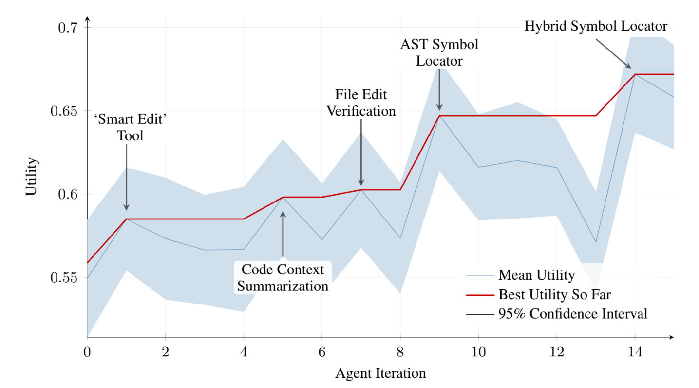

We code AI agent that codes. What if we code AI agents that code another agent which codes better than us?  😖  Some researchers in Bristol university, UK with crazy ideas and deep packet had this very idea. The result is in this [research paper](https://arxiv.org/abs/2504.15228). No kidding, their 15 iterations cost them $7000. It improved the Agent's performance three-fold.

**S**elf **I**mproving **C**oding **A**gent aka **SICA** is a coding agent that can rewrite its own code. The rationale behind this idea is *"What if we overlooked something?"* By letting LLMs think on their own and explore new possibilities, we might discover better solutions. You might be familiar with AlphaGo's [move-37](https://www.linkedin.com/pulse/move-37-moment-ai-shattered-human-expectations-suresh-mk-wvezc/). The AI invented a new move in a game that had been played for thousands of years. This means that, due to our limited cognitive ability, we overlooked some winning moves and never played them until AlphaGo unveiled one in Game-2. The SICA project is a similar search for overlooked solutions. What if there is a better way to solve a coding challenge that we are still missing?

Here is a quote from the paper.

> A motivation for a self-improving system is that the improvements in coding abilities
may be leveraged during subsequent improvement steps, hopefully compounding.

This is a very simple project.

 1. Develop a very basic AI agent that can read, write and execute code
 2. Give it 50 test-cases as a benchmark and ask it to solve them.
 3. Based on the results, Ask it to rewrite it's own code
 4. Goto Step-2

## Non Gradient based learning

This research introduces a novel learning method. In a typical machine-learning algorithm, we adjust the weights after every iteration based on a utility function or a loss function. But in SICA, the weights are fixed. The learning happens online and the adjustment happens in the code with fixed weights.

The utility function is simple and direct.

> \( U = w_{score}p_{score} + w_{cost}(1 − min(1, p_{cost}/$10)) + w_{time}(1 − min(1, p_{time}/300s)) \)

- \( p_{score} \) --> Benchmark solving score. Normalized between 0 and 1.
- \( p_{cost} \) --> Cost in $ it took to achieve the result. Anything beyond $10 adds same loss.
- \( p_{time} \) --> Time taken to solve the problems. Anything runs for more than 5 mins incur same loss.
 
 
- \( w_{score} \) --> Weight of the score. Fixed to 0.5
- \( w_{cost} \) --> Weight of the cost. Fixed to 0.25
- \( w_{time} \) --> Weight of the time. Fixed to 0.25

*They added a small penalty on timeouts - Not captured here for simplicity.*

The human developed basic AI agent is given the 50 test-case benchmark. The percentage of successful solving is normalized between 0 and 1 - \( p_{score} \), time taken to complete the task - \( p_{cost} \) and the LLM token cost incurred to complete the task - \( p_{time} \) are measured and fed to the utility function. The commit-sha of the code (identifier of the current version), execution logs and the utility score are stored in an archive.

Then LLM is asked to review the logs and rewrite the agent's code to improve the performance. Once again the complete benchmark is run on the new code, utility value is captured. If the utility value increases, that is the trajectory forward. This new code will be taken as baseline and next iteration will be started. Otherwise, fallback to the previous version itself.

In this novel non-gradient based approach we don't fit the model by adjusting weights. With fixed weights in place, we update the model's code. The coefficients of the linear function remains fixed and we fix the functions that produce the variables.

## Guardrails

Neither AI nor humans are matured enough to give AI full autonomy. So, SICA would lead to catastrophe unless proper failsafe mechanisms are taken. For starters, if the Agent introduces a compiler error into it's code, it can never recover. So, two instances of the agent - one acts as the researcher and other acts as the lab rat. The code that selects the forward propagation and the code that runs the benchmark are executed in different instances. So, if the benchmarking agent fails into unrecoverable loop, the utility agent have a failsafe to either fix the error or pick a different agent from the archive.

There is always a risk of hallucination when work is this big scale. So, the researchers employed a overseer agent which is outside of the self-improving agent. It runs asynchronous, called every 30 seconds to check whether the self-improving agent is running on correct path. If it finds a sign of hallucination, the current run of the self-improving agent is killed and the iteration starts over. There employed a complex mechanism to present the complete state and trajectory of the self-improving agent to overseer agent which is detailed in the paper.

## Execution, Results

When we mark the order of iteration in the x-axis and the utility performance in the y-axis, we get below graph.

The experiment ran for 15 iterations. The basic human-developed agent with only open, read and write capability was added with new tools upon every iteration. Over a period the performance improved from 17% to 53%.

At every inflection point, there was a new breakthrough in the agent's approach. For example, At the first iteration, the agent developed a smart-edit tool. After that the performance improved about 5%. Significant leap in performance occurred when the agent developed an AST symbol locator in the 9th iteration. 10% improvement observed after that.

This is the easter egg we're searching for. The LLM understood the core problem and implemented the right tools to solve the problem. More than its proof that LLM can be self relying, it sets a direction for human developers. Like AlphaGo enlightened us with a new move, SICA introduced the AST symbol locator. It would've taken months of manual trial-and-error to foresee the use of such tool in daily coding task and measure it's impact. But SICA has done that in less than 24 hours. With more iterations, SICA has the potential to implement more innovative tool.

## *The Influence*

*Before going overly optimistic about AI, we should understand that the success of SICA is achieved with some intelligent influence by the developers. They have introduced two synthetic benchmarks. 1) File editing - Ask LLM to make known changes and score it based on the matching. 2) Code navigation - Ask interesting questions about symbol definition and references.*

*The major problem in solving the 50 test-case benchmark was editing files at correct place without syntax errors and navigating the code-base to update relevant code. But LLM wasn't intelligent enough to give first preference to these two problems. Or it didn't do it in the small number of initial iterations. So, to accelerate the attention, the researches introduced these synthetic benchmarks. It's an intelligent approach to define a utility over the problem instead of just telling it as a problem in the prompt.*

## Conclusion

The SICA project has opened doors to groundbreaking advancements in AI, showcasing the potential of non-gradient-based learning, collaborative LLM systems, and the strategic use of synthetic benchmarks to guide AI focus. By iteratively improving its own code, SICA demonstrated significant performance gains, culminating in the creation of innovative tools like the AST symbol locator. As highlighted in Antonio Gulli's "Agentic Design Patterns," such agentic systems illustrate how AI can surpass human limitations, offering transformative approaches to autonomous learning and development. With robust safeguards in place, SICA sets a precedent for building safer, smarter, and more adaptive AI systems.
