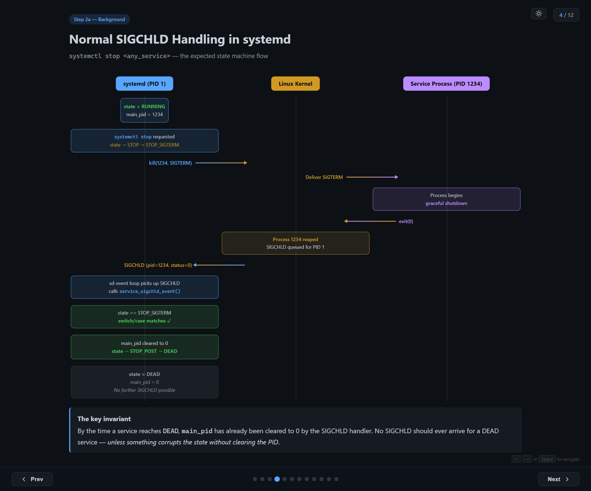
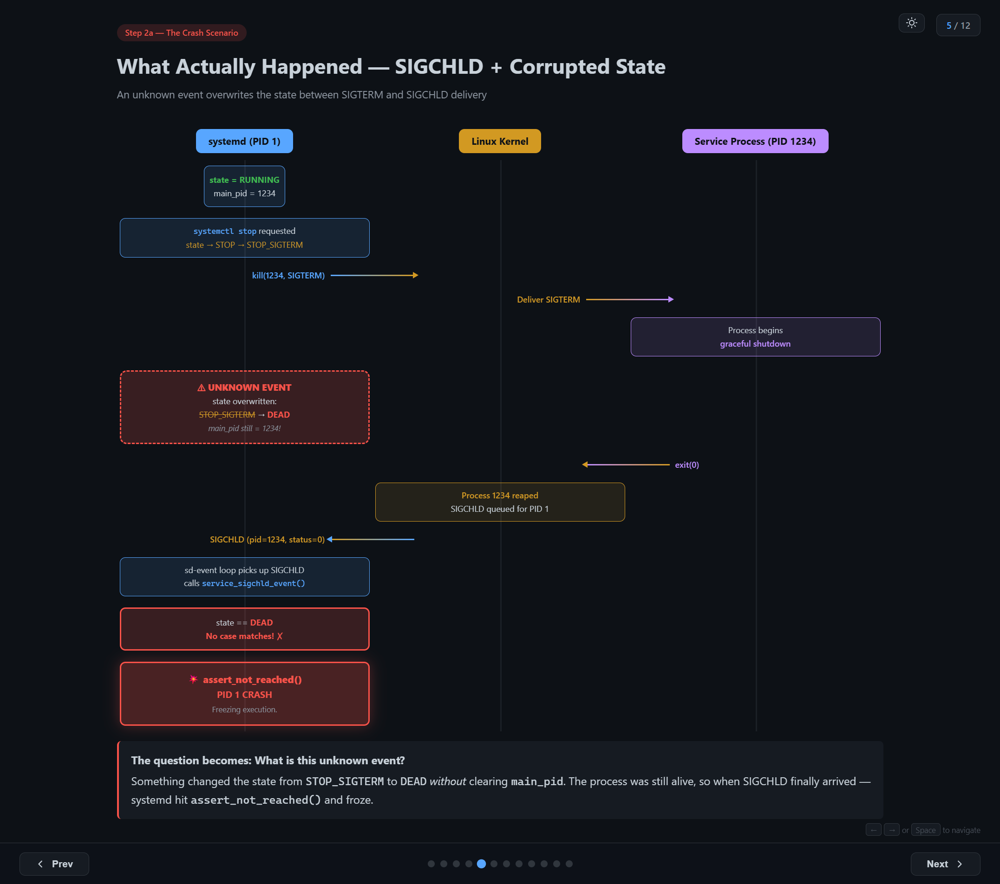
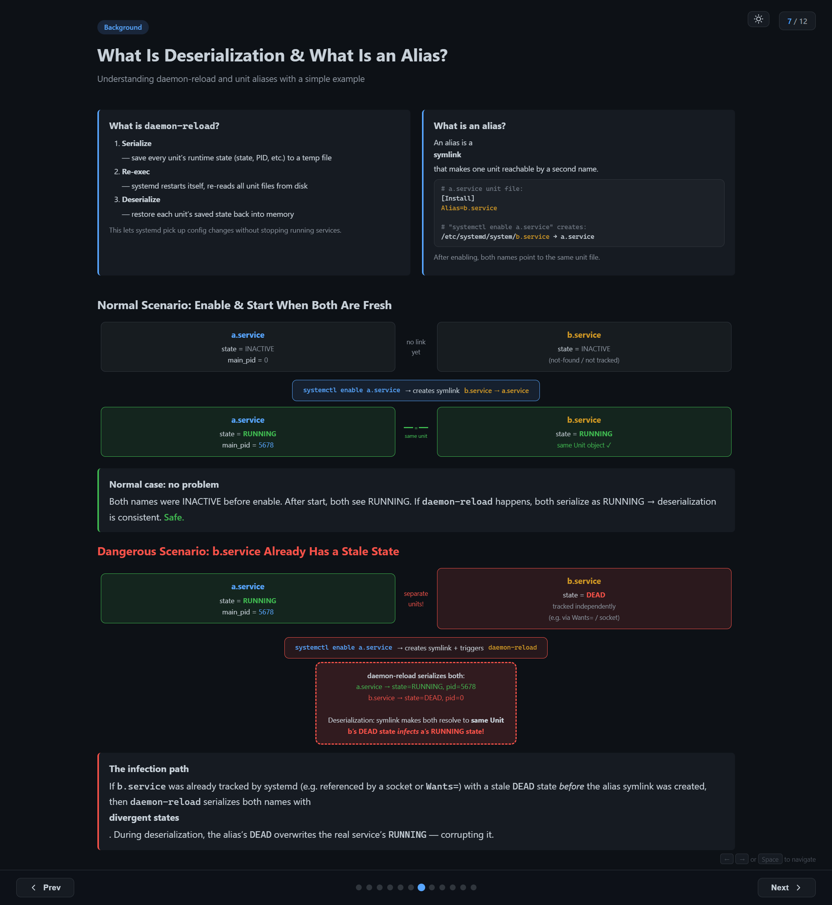
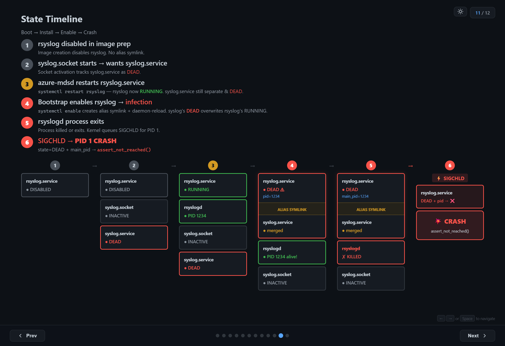

29 VMs crashed. 1,600+ VMs were mid-rollout. PID 1 — systemd itself — hit `assert_not_reached()` and froze. Every `systemctl` command after that returned "Transport endpoint is not connected." The VMs were effectively bricked.

This is the story of how we tracked down a race condition in systemd's unit alias deserialization — a bug that only triggers under a specific sequence of operations, depends on hashmap iteration ordering, and is completely invisible after a reboot.

## Step 1: Finding the Crash

The first reports came in as a rolling upgrade failure. The bootstrap script that configures services on fresh VMs was failing repeatedly:

```
...
Created symlink /etc/systemd/system/syslog.service → /usr/lib/systemd/system/rsyslog.service.
Restarting service rsyslog.service
Failed to restart rsyslog.service: Transport endpoint is not connected
Failed to activate service 'org.freedesktop.systemd1': timed out (service_start_timeout=25000ms)
... (5 retries, all fail) ...
Aborting
```

The error message "Transport endpoint is not connected" is misleading. It suggests a D-Bus communication issue, maybe a socket problem. But the real issue was far worse: **systemd (PID 1) itself had crashed**. Every subsequent `systemctl` command failed because there was no init process to talk to.

Digging into the journal logs from the previous boot (`journalctl -b -1`) revealed the actual crash sequence:

```
02:37:20  systemd[1]: Stopping rsyslog.service...          ← stop begins
              ----------- rsyslog SIGCHLD pending -----------
02:37:21  systemd[1]: Reloading requested from PID 3267    ← daemon-reload
          systemd[1]: Reloading finished in 204 ms.
          systemd[1]: service_sigchld_event() ABORT         ← SIGCHLD arrives
          systemd[1]: Freezing execution.                   ← PID 1 CRASH
```

It's a self induced crash. Systemd developers don't expect the condition to reach that code. So, they introduced a self-freezing instruction there. It was not there prior to version 254. So, this condition would have been silently ignored in older versions.

## Step 2: Reading the Source Code

The crash message pointed directly to `service_sigchld_event()` in `src/core/service.c`. Here's the simplified version of the code:

```c
// src/core/service.c — systemd 255 (simplified)

static void service_sigchld_event(Unit *u, pid_t pid, int code, int status) {
    Service *s = SERVICE(u);

    if (s->main_pid.pid == pid) {
        s->main_pid.pid = 0;

        switch (s->state) {
            case SERVICE_START:
            case SERVICE_START_POST:
                /* handle start completion */  break;
            case SERVICE_RUNNING:
                /* handle process exit */       break;
            case SERVICE_STOP:
            case SERVICE_STOP_SIGTERM:
            case SERVICE_STOP_SIGKILL:
                /* handle normal stop */        break;
            default:
                assert_not_reached();       // line 3863 — CRASH
        }
    }
}
```

The function handles SIGCHLD — the signal the kernel sends to a parent process when a child exits. systemd, as PID 1, receives SIGCHLD for every service process it manages.

The `switch` statement covers all legitimate states a service can be in when its main process exits: starting, running, or being stopped. But when the state is something else — like `SERVICE_DEAD` — it hits the `default` branch and calls `assert_not_reached()`.

For PID 1, an assertion failure is catastrophic. There's no parent process to catch it. systemd freezes execution, and the entire system becomes unresponsive.

### The Impossible State

The crash tells us something that shouldn't be possible: a service's `state` was `SERVICE_DEAD`, but `main_pid` still held a valid PID. A dead service should never own a running process. systemd treats this contradiction as a logic error — hence the assertion.

But how did we get here?

### Normal SIGCHLD Handling

To understand the bug, you first need to understand the normal flow when you stop a service:



1. **Initial state**: service is `RUNNING`, `main_pid = 1234`
2. **`systemctl stop` requested**: state transitions to `STOP` → `STOP_SIGTERM`
3. **systemd sends `kill(1234, SIGTERM)`** to the kernel
4. **Kernel delivers SIGTERM** to the service process
5. **Process begins graceful shutdown** and eventually calls `exit(0)`
6. **Kernel reaps process 1234** and queues SIGCHLD for PID 1
7. **systemd's event loop picks up SIGCHLD**, calls `service_sigchld_event()`
8. **`switch` matches `STOP_SIGTERM`** — the expected case
9. **`main_pid` cleared to 0**, state transitions to `STOP_POST` → `DEAD`

The key invariant: by the time a service reaches `DEAD`, `main_pid` has already been cleared to 0 by the SIGCHLD handler. No SIGCHLD should ever arrive for a DEAD service — *unless something corrupts the state without clearing the PID*.

### The Crash Scenario

What actually happened was different. Between steps 2 and 6, something intervened:



1. Service is `RUNNING`, `main_pid = 1234`
2. `systemctl stop` → state becomes `STOP_SIGTERM`
3. systemd sends `SIGTERM` to the process
4. Process begins graceful shutdown...
5. **⚠ UNKNOWN EVENT** — state is overwritten from `STOP_SIGTERM` → `DEAD`, but `main_pid` stays `1234`
6. Process exits, kernel queues SIGCHLD
7. systemd receives SIGCHLD, calls `service_sigchld_event()`
8. `state == DEAD` — **no case matches!**
9. `assert_not_reached()` → **PID 1 CRASH**

The question became: **what is this unknown event?**

## Step 3: Building a Hypothesis

We needed to find an operation that:

- Overwrites a unit's `state` field (e.g., `STOP_SIGTERM` → `DEAD`)
- Does **not** clear `main_pid`

We launched GitHub Copilot on systemd code base and asked above question. "Analyse the code and get me where the state transition is possible without updating the pid". Below are the output we got from the agent.

**Direct state setter?** State transitions within systemd always go through `service_set_state()`, which clears `main_pid` when entering `DEAD`. This path is safe.

**Unit reload / re-read config?** Re-reading unit files updates configuration but does not overwrite runtime state or PID tracking. This path is safe too.

**Deserialization (daemon-reload)?** During `daemon-reload`, systemd serializes all unit states to a file, re-execs, and deserializes them back. The deserialized state is written *directly* to `s->deserialized_state` — **bypassing `service_set_state()`!**

Unlike normal state transitions, deserialization writes state directly into the unit object without going through the state setter function. This means it can set a state like `DEAD` without the usual cleanup that would clear `main_pid`.

Deserialization was our suspect. But how exactly does it corrupt the state? To understand that, we need to understand aliases.

## Background: daemon-reload and Unit Aliases

### What is daemon-reload?

When you run `systemctl daemon-reload`, systemd does three things:

1. **Serialize** — save every unit's runtime state (state, PID, etc.) to a temp file
2. **Re-exec** — systemd restarts itself, re-reads all unit files from disk
3. **Deserialize** — restore each unit's saved state back into memory

This lets systemd pick up config changes without stopping running services. It's an elegant design — unless the serialized data contains contradictions.

### What is an alias?

An alias is a symlink that makes one unit reachable by a second name:

```ini
# a.service unit file:
[Install]
Alias=b.service

# "systemctl enable a.service" creates:
# /etc/systemd/system/b.service → a.service
```

After enabling, both names point to the same unit file.

### The Normal Case

When both names are fresh (neither has been started or tracked), everything works fine:

1. `a.service` and `b.service` are both `INACTIVE`
2. `systemctl enable a.service` creates the symlink `b.service → a.service`
3. `systemctl start a.service` → both names resolve to the same Unit object, state = `RUNNING`
4. If `daemon-reload` happens, both serialize as `RUNNING` → deserialization is consistent

No problem.

### The Dangerous Case

But what if `b.service` was already tracked by systemd *before* the alias was created?

This can happen if something else references `b.service` — for example, a socket unit (`b.socket`) that implicitly depends on `b.service` via socket activation. systemd starts tracking `b.service` as a separate unit with state `DEAD` (because it can't find a unit file for it).

Now you have:

- `a.service` — `RUNNING`, `main_pid = 5678`
- `b.service` — `DEAD` (tracked independently via socket dependency)

When `systemctl enable a.service` creates the alias symlink and triggers `daemon-reload`:

1. systemd serializes both units with their divergent states:
    - `a.service → state=RUNNING, pid=5678`
    - `b.service → state=DEAD, pid=0`
2. During deserialization, the alias symlink makes both names resolve to the **same Unit object**
3. **b's `DEAD` state overwrites a's `RUNNING` state**

The result: `a.service` now has `state=DEAD` but `main_pid=5678` — the process is still alive! The next SIGCHLD for that PID triggers the assertion and crashes PID 1.



## Step 3: Reproducing the Bug

To confirm the hypothesis, we built a minimal reproduction using two unit files:

**a.service** — the real service (long-running):

```ini
[Unit]
Description=Demo service A

[Service]
ExecStart=/bin/sleep 600
Restart=no

[Install]
WantedBy=multi-user.target
Alias=b.service
```

**b.socket** — implicitly depends on b.service (socket activation):

```ini
[Unit]
Description=Demo socket B

[Socket]
ListenStream=/run/b.sock

[Install]
WantedBy=sockets.target
```

The key: `b.socket` inherently triggers `b.service`. systemd tracks `b.service` as not-found / `DEAD` until the alias from `a.service` becomes effective.

### The Reproduction Steps

```bash
# Step 1: Install a.service and b.socket, no b.service yet
$ cp a.service /etc/systemd/system/
$ cp b.socket /etc/systemd/system/
$ systemctl daemon-reload

# Step 2: Start b.socket → implicit dep on b.service makes systemd track b as DEAD
$ systemctl start b.socket
$ systemctl show b.service --property=ActiveState  →  inactive (tracked!)

# Step 3: Start a.service → RUNNING with a PID
$ systemctl start a.service
$ systemctl show a.service --property=MainPID      →  4567
$ systemctl show a.service --property=ActiveState   →  active

# Step 4: Enable a.service → creates symlink b.service → a.service + daemon-reload
$ systemctl enable a.service
# Created symlink /etc/systemd/system/b.service → .../a.service

# Step 5: Check — state INFECTED!
$ systemctl show a.service --property=ActiveState   →  inactive  ← was RUNNING!
$ systemctl show a.service --property=MainPID       →  4567     ← PID still set!
$ ps -p 4567                                        →  sleep 600 ← still alive!

# Step 6: Kill PID → SIGCHLD → CRASH
$ kill 4567  → systemd[1]: Freezing execution.
```

There's a wrinkle: whether `b.service` is deserialized *after* `a.service` depends on hashmap iteration order, which is randomized per process. You might need to run `systemctl daemon-reexec` to re-seed the hash and retry if the corruption doesn't happen on the first attempt. This is what makes the bug non-deterministic — the same sequence of operations might crash on one VM but not another.

## Step 4: Finding the Infected Service in Production

Reproducing in a lab is one thing. Finding which service was actually infected on the crashed production VMs was harder. The corrupted state is **transient** — it only exists in the brief window between `daemon-reload` and the next restart. After a reboot, the evidence is gone.

### Attempt 1: Boot Script Detection

We added a boot script to detect the impossible state:

```bash
#!/bin/bash — detect_infected_service.sh (runs at boot)
for unit in $(systemctl list-units --type=service --all --no-legend \
              | awk '{print $1}'); do
    state=$(systemctl show "$unit" --property=ActiveState --value)
    pid=$(systemctl show "$unit" --property=MainPID --value)
    if [[ "$state" == "inactive" || "$state" == "dead" ]] \
       && [[ "$pid" -gt 0 ]]; then
        echo "INFECTED: $unit  state=$state  main_pid=$pid"
    fi
done
```

**Result: nothing found.** By the time the VM fully boots, the service has likely been restarted multiple times by other scripts. The infection only exists in that brief window.

### Attempt 2: Duplicate Process Detection

Then we had a key insight: when systemd thinks a service is `DEAD` but `start` is called again, the *old* process (from the infected state) is still running. systemd detects a duplicate main PID and logs an error before killing the old process. Only the second restart actually starts a fresh process.

```bash
# Search for duplicate PID detection in journal
$ journalctl -b -1 | grep "Found left-over process"

systemd[1]: rsyslog.service: Found left-over process 1234 (rsyslogd)
            which is already a command process of rsyslog.service.
            Refusing.
```

**Found it: `rsyslog.service`.** The "Found left-over process" log proves that when systemd tried to restart rsyslog, it found a leftover process from the corrupted state — a process systemd thought shouldn't exist (state=`DEAD`) but was actually still running.

## Step 5: Connecting the Dots

With `rsyslog.service` identified as the infected service, everything clicked. Let's look at its unit file:

```ini
# /usr/lib/systemd/system/rsyslog.service
[Unit]
Description=System Logging Service
Requires=syslog.socket

[Service]
Type=notify
ExecStart=/usr/sbin/rsyslogd -n -iNONE

[Install]
WantedBy=multi-user.target
Alias=syslog.service          ← the alias!
```

`rsyslog.service` has `Alias=syslog.service`. This maps exactly to our `a.service` / `b.service` experiment:

| Experiment | Production |
|:---|:---|
| `a.service` (real service, `RUNNING`) | `rsyslog.service` (`RUNNING`, PID 1234) |
| `b.service` (alias, tracked as `DEAD`) | `syslog.service` (`DEAD`, tracked via `syslog.socket`) |
| `b.socket` (triggers tracking of b) | `syslog.socket` (triggers tracking of `syslog.service`) |

## The Full Timeline

Here's the complete sequence of events that led to the crash on the production VMs:

**1. Image preparation:** rsyslog is **disabled** in the VM image. The alias symlink (`syslog.service → rsyslog.service`) does not exist.

**2. Boot — syslog.socket starts:** Socket activation pulls in `syslog.service` as a dependency. Since there's no unit file or symlink for `syslog.service`, systemd tracks it as a separate unit with state `DEAD`.

**3. azure-mdsd restarts rsyslog:** A monitoring agent runs `systemctl restart rsyslog.service`. rsyslog is now `RUNNING` with a PID. But `syslog.service` is still a separate unit, still `DEAD`.

**4. Bootstrap script enables rsyslog — infection:** The bootstrap script runs `systemctl enable rsyslog.service`, which creates the alias symlink and triggers `daemon-reload`. During deserialization, `syslog.service`'s `DEAD` state overwrites `rsyslog.service`'s `RUNNING` state. Now rsyslog has `state=DEAD` but `main_pid` still points to the living rsyslogd process.

**5. rsyslogd process exits:** The bootstrap script continues and stops/restarts rsyslog. The old rsyslogd process receives SIGTERM and exits. The kernel queues SIGCHLD for PID 1.

**6. SIGCHLD → PID 1 CRASH:** systemd's event loop picks up the SIGCHLD. It finds `state=DEAD` with a valid `main_pid`. The switch statement has no matching case. `assert_not_reached()`. PID 1 freezes. The VM is bricked.



All the sequence should happen in order in a specific time window to experience the crash. If any one misses, we'll not see the issue. That is the reason why we saw this crash only on 29 machines out of 1600. And that was the reason which made this debugging so complex.

## Lessons Learned

**Misleading error messages are the norm, not the exception.** "Transport endpoint is not connected" had nothing to do with transport endpoints. PID 1 was dead. Always check `systemctl status` and `journalctl` before trusting error messages at face value.

**Transient state corruption is hard to catch.** The infected state only existed for a few seconds between `daemon-reload` and the next service restart. Boot-time detection scripts couldn't see it. We had to rely on indirect evidence — the "Found left-over process" log — to identify the victim. That single line of log saved us the big time.

**Non-deterministic bugs need statistical thinking.** The same bootstrap script, the same VM image, the same systemd version — but only ~2% of VMs crashed. Hashmap iteration order is the kind of non-determinism that makes you question your sanity until you understand the mechanism. Building a hypothesis and looking for evidences is the better approach in these scenarios.

---

*The root cause: According to me it's not a bug of systemd. When the user creates a situation of two unit files with two different states and ask systemd to converge them, there is no way for systemd to pick the correct state every time. The trigger: `systemctl enable` + `daemon-reload` while the aliased service is running and the alias name was previously tracked independently. The result: PID 1 crash, VM freeze.*

I presented a talk about this issue in [Linux Kernel Meetup, Bangalore](https://kernelmeetup.wordpress.com/). It was well received by the audiences and created a lot of discussion.
