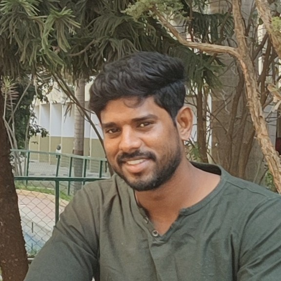

  </img>
  <h1 style="display: inline-block; vertical-align: middle; margin: 0; margin-left:25px">Balakumaran Kannan</h1>

Welcome to my blog! :wave:

I'm Bala, a **Principal Software Engineer** at **:fontawesome-brands-microsoft: Microsoft**.

With a background as a Linux Systems Engineer, I've recently embarked on an exciting journey into the world of Artificial Intelligence. My current focus lies at the intersection of these domains—exploring how Large Language Models (LLMs) can better understand Linux code to enhance developer productivity and streamline the development process.

As a Stable Maintainer of Azure Linux (Microsoft's in-house Linux distribution), I bring hands-on experience with enterprise-grade Linux systems. Through this blog, I share my learnings, insights, and discoveries as I navigate the evolving landscape of technology.

## :fontawesome-brands-linkedin:<a href="https://www.linkedin.com/in/balakumaran-kannan/"><i class="fab fa-github"></i> LinkedIn</a>

## My Experience

??? tip ":fontawesome-brands-microsoft: Microsoft"
    * Building a multi-agent CVE patching system using [SWE-agent](https://github.com/SWE-agent/SWE-agent)
    * Stable-Maintainer of [Azure Linux](https://github.com/microsoft/azurelinux)
    * Build & Release systems design-to-development for [Azure Linux](https://github.com/microsoft/azurelinux) and customer support
    * [LISA](https://github.com/microsoft/lisa)

??? success ":fontawesome-solid-cart-shopping: Flipkart"
    * Life-cycle management for all Baremetal Operating Systems
    * Minute level hardware usage metric collection from more than 150,000 systems
    * Litmus - A data-center simulation for verifying baremetals health
    * VM life-cycle orchestrator development

??? success ":material-crop-landscape: HPE"
    * Owner of Service-OS for ARM based switches
    * Board bring-up, U-boot and Linux port to ARM platforms

??? success ":material-gamepad: Sony"
    * Support userspace and kernel network stack for Linux based SONY devices

## Patents

:fontawesome-solid-award: [Highly available DHCP service by running DHCP servers on a blockchain network](https://patents.google.com/patent/US10862859B2/)  
:fontawesome-solid-award: [Multiple-site private network secured by IPsec using blockchain network for key exchange](https://patents.google.com/patent/US11349653B2/)  
:fontawesome-solid-graduation-cap: [System and method of optimizing vm disk data transfer time for cold migration by preloading page-cache](https://patents.google.com/patent/US20220214905A1)  
:fontawesome-solid-graduation-cap: Ind. patent application - 202141004517: Common IP based network communication between virtual machine and host

## :fontawesome-brands-github: [0xba1a](https://github.com/0xba1a)
<iframe  width=800px height=200px frameborder=0 src="https://greptile-stats.vercel.app/api/widget/0xba1a/stats">
</iframe>
<iframe width=800px height=260px frameborder=0 src="https://greptile-stats.vercel.app/api/widget/0xba1a/contributions">
</iframe>
